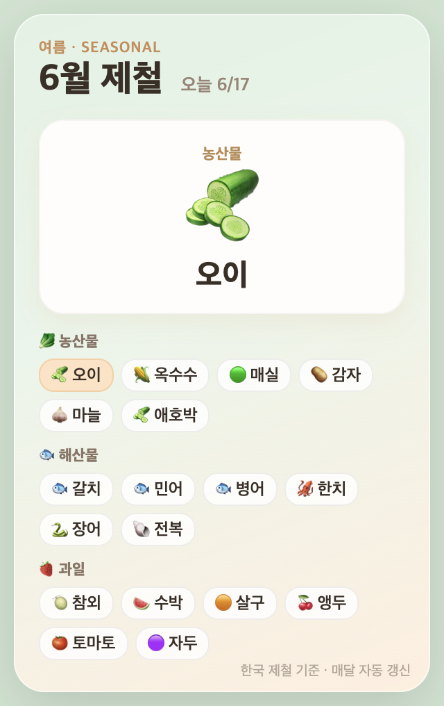

# 🍽️ 제철 음식 위젯 (Seasonal Food Widget)

한국의 **월별 제철 음식**(농산물 · 해산물 · 과일)을 바탕화면에 항상 띄워주는 작은 데스크탑 위젯입니다.
이번 달 제철 음식이 표시되고, 농산물·해산물·과일을 가로질러 **랜덤으로 번갈아** 크게 보여줍니다. 매달 자동으로 그 달 음식으로 바뀝니다.



## ✨ 특징
- 📅 **월별 자동 전환** — 시스템 날짜 기준으로 이번 달 제철 음식 표시
- 🎲 **랜덤 피처** — 농산물/해산물/과일을 무작위로 번갈아 강조 (3.5초마다)
- 🪟 **항상 위 · 투명 · 드래그 이동** — 어느 화면에서나 떠 있는 위젯
- 🧺 **트레이 메뉴** — 보이기/숨기기, 로그인 시 자동 시작 토글, 종료
- 🇰🇷 12개월 × (농산물·해산물·과일) 데이터 내장

## 🚀 설치 & 실행
```bash
git clone https://github.com/<your-name>/seasonal-food-widget.git
cd seasonal-food-widget
npm install
npm start
```

### 로그인 시 자동 시작 (macOS)
트레이 아이콘 메뉴에서 **"로그인 시 자동 시작"**을 켜거나, LaunchAgent를 직접 등록할 수 있습니다:
```bash
cp packaging/com.example.seasonal-food-widget.plist ~/Library/LaunchAgents/
# plist 안의 경로를 본인 환경에 맞게 수정한 뒤
launchctl load ~/Library/LaunchAgents/com.example.seasonal-food-widget.plist
```

## 🗂️ 데이터 수정
제철 음식 목록은 [`data.js`](data.js) 한 파일에 들어 있습니다.
`window.SEASONAL[월] = { produce:[["이름","🥬"],...], seafood:[...], fruit:[...] }`
형식이라 원하는 음식을 자유롭게 추가/수정하면 됩니다.

## 🛠️ 기술
Electron · HTML/CSS/JS. 외부 네트워크 요청 없음(데이터 로컬 내장).

## 📄 라이선스
MIT — 자유롭게 사용/수정/배포하세요.
